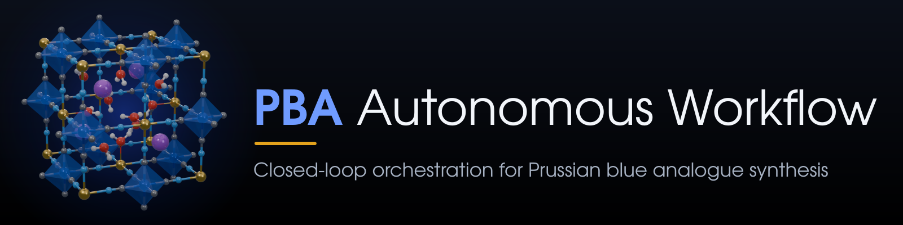
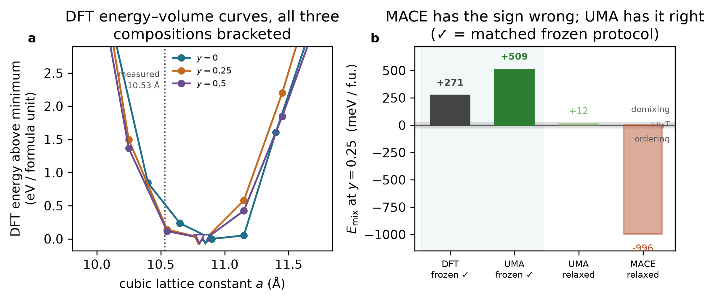

<p align="center"></p>

# PBA Autonomous Workflow

**`pba-autoworkflow`**: closed-loop orchestration for Prussian blue analogue synthesis

[](../../actions/workflows/tests.yml)
[](LICENSE)

Orchestration software for an autonomous materials-acceleration platform (self-driving lab)
for Prussian blue analogues, with a thermodynamics module that benchmarks universal
interatomic potentials against DFT. **Status:** demonstrated on a simulated instrument deck;
not yet connected to physical hardware. The full technical account is in
[docs/PROJECT_SUMMARY.md](docs/PROJECT_SUMMARY.md).

A Python orchestrator for an autonomous Materials Acceleration Platform targeting
PBA cathode materials (Na<sub>x</sub>M[Fe(CN)<sub>6</sub>]<sub>1−y</sub>·zH<sub>2</sub>O,
M = Mn, Fe, Co, Ni, Cu, Zn). It plans experiments, drives instruments, reduces raw
traces to descriptors, records everything, and closes the loop with a constrained
multi-objective optimizer. The current focus is phase formation and polymorph
control, judged from powder XRD: each campaign targets one framework phase (for
example cubic or rhombohedral R-3c zinc hexacyanoferrate), and drying temperature
and atmosphere are part of the recipe.

*This project has received funding under the grant agreement with the Research Council of Lithuania (LMTLT) (Project No. S-ITP-24-7).*

The device layer is abstract. Simulated drivers ship with it so the whole loop
runs end-to-end today; going live means implementing the same protocol against
real hardware, one instrument at a time.

## Quick start

```bash
pip install -e ".[test]"            # orchestrator only
pip install -e ".[test,thermo]"     # + thermodynamics module

# Plan a seed batch and check feasibility without touching hardware
python -m pba_autoworkflow dry-run --batch-size 8

# Run a closed-loop campaign against the simulated deck
python -m pba_autoworkflow run --runs runs/demo --iterations 6 --n-seed 16 --batch-size 8

# Resume after a crash (or after adding budget), then report
python -m pba_autoworkflow resume --runs runs/demo --iterations 3
python -m pba_autoworkflow status --runs runs/demo
python -m pba_autoworkflow report --runs runs/demo
```

`--time-scale` sets how much of the real instrument dwell time is actually
waited: `0` runs the loop as fast as the analysis allows, `2e-4` gives a
realistic contention pattern in seconds, `1.0` is a full timing rehearsal.

## Documentation

The **[user guide](docs/guide/README.md)** covers installation, a complete tutorial on the
simulated deck, the concepts behind the loop, the Python API, connecting real instruments, the
thermodynamics module, and troubleshooting. Runnable examples are in [`examples/`](examples).

## Architecture

```
                 ┌──────────────────────────────────────────┐
                 │ campaign.py     the closed loop           │
                 │ plan → register → execute → analyse → stop│
                 └───────┬──────────────────────┬────────────┘
        ┌────────────────┘                      └───────────────┐
┌───────▼─────────┐                                   ┌─────────▼────────┐
│ optimize/       │                                   │ scheduler.py     │
│  surrogate (GP) │                                   │ station pool,    │
│  planner (qNEHVI│                                   │ batch concurrency│
│   / Sobol / rnd)│                                   └─────────┬────────┘
└───────▲─────────┘                                   ┌─────────▼────────┐
        │                                             │ workflow.py      │
┌───────┴─────────┐                                   │ one recipe, deck │
│ analysis/       │◄──────────────────────────────────┤ → descriptors    │
│  xrd, spectra,  │        raw traces                 └─────────┬────────┘
│  objectives+QC  │                                   ┌─────────▼────────┐
└─────────────────┘                                   │ devices/base.py  │
                                                      │ async protocols  │
┌─────────────────┐                                   └─────────┬────────┘
│ provenance.py   │◄── every call, trace, descriptor   ┌─────────▼────────┐
│ append-only     │                                   │ devices/simulated│
│ SQLite + npz    │                                   │  ▲ swap for real │
└─────────────────┘                                   └─────────┬────────┘
                                                      ┌─────────▼────────┐
┌─────────────────┐                                   │ sim/             │
│ schema.py       │  typed data model, design space    │ ground_truth,    │
│ clock.py        │  timestamps vs durations          │ instruments      │
└─────────────────┘                                   └──────────────────┘
```

One rule holds the design together: **the analysis and optimization layers may
never import `sim/`.** They reach the hidden chemistry only by measuring
simulated traces, exactly as they will on the bench. That is what makes the
simulated loop a test of the orchestrator rather than a test of the simulator.

## Going live

Each instrument is one class implementing one protocol from
`pba_autoworkflow/devices/base.py`. Nothing above the device layer changes.

```python
from pba_autoworkflow.devices.base import Device, VesselHandle, TransportError, HardwareFault

class OpentronsLiquidHandler(Device):
    capacity = 1

    async def prepare_solution(self, vessel: VesselHandle,
                               components: dict[str, float],
                               volume_mL: float) -> VesselHandle:
        try:
            run_id = await self._post("/runs", self._protocol(components, volume_mL))
            await self._await_run(run_id)
        except httpx.TransportError as err:
            raise TransportError(f"{self.device_id}: {err}") from err   # retried
        except RobotError as err:
            raise HardwareFault(f"{self.device_id}: {err}") from err     # terminal
        vessel.contents_mL = volume_mL
        return vessel
```

Then assemble a `Platform` with your driver in place of the simulated one and
pass it to `Campaign`. Two contracts matter:

- **Raise the right error class.** `TransportError` means the operation never
  started and is safe to retry; the workflow retries it with backoff.
  `HardwareFault` is terminal for that experiment and the campaign continues with
  the rest of the batch. Getting this backwards either retries a physically
  destructive step or throws away recoverable runs.
- **`status()` must be idempotent and safe at any time**, including mid-operation
  — the scheduler polls it.

Mixed decks are fine: keep `SimulatedDiffractometer` while your real liquid
handler comes online.

## Design decisions worth knowing

**Feasibility is lexicographic, not penalized.** Yield below the floor makes a
run infeasible, and `scalarize` returns a strictly negative score for any
infeasible point. With a tunable penalty a high-scoring infeasible run can
outrank a feasible one, and the campaign then reports a "best" recipe that did
not produce enough solid to characterize.

**Objectives are not clipped at their ideal values.** A near-perfect framework
assays at Fe/M = 1 ± error, so half of those measurements land above unity.
Clipping the derived vacancy at zero collapses every good sample onto exactly
1.000, flattening the Pareto front to a single point and leaving the planner
nothing to rank. Measured quantities carry their assay error; QC decides what is
tolerable, and the physical models clamp at their own point of use.

**Durations are monotonic, timestamps are wall-clock** (`clock.py`). A host that
suspends mid-campaign made one iteration report 81 495 s, which rendered the
bottleneck meaningless. `duration_s` is stored, not an end timestamp.

**Reflection labels are generated from the F-centring condition**, not tabulated.
A hand-typed table is where an *hkl* silently acquires the wrong label, and a
mislabelled reflection is indistinguishable from a mis-indexed pattern to whoever
reads the report.

**The Fe analogue needs a carbon assay, and the code refuses to fake one.** ICP
reports a single indistinguishable iron pool for Prussian blue itself, so total Fe
cannot be split between the N and C sites by any assumption — an earlier version
split it 50/50, which forces Fe/M to exactly 1.000 and reports every Prussian blue
sample as vacancy-free no matter what was synthesized. The optimizer promptly
concluded Fe was the best analogue. CHN carbon measures the hexacyanoferrate
sublattice directly (six C per intact `[Fe(CN)6]`), so it is used for every
analogue and is *required* for Fe: without it `vacancy_fraction` is NaN, meaning
undetermined, and QC rejects the sample rather than letting a fabricated
composition train the surrogate. If your deck has no CHN, exclude Fe from the
design space.

**Chemistry failures and mechanical failures are separate.** A clogged tip is a
property of the deck, not of the product. When the simulator sampled both, a run
could be marked failed with a mode no device raised — so it proceeded and was
scored as a success, producing a silently wrong training label.

**The simulated backend reconstructs the recipe from the commands the deck
actually received**, rather than being handed the intended recipe. A workflow bug
that dispenses the wrong volume therefore shows up as wrong chemistry, which is
how it would present on real hardware.

**Replicates are scheduled, not assumed.** A fraction of each batch repeats an
earlier recipe, giving a live estimate of platform reproducibility. Without it you
cannot tell whether a surrogate is fitting chemistry or noise.

## Data model

`schema.py` is the single source of truth. Units are in the field names
(`c_metal_M`, `temperature_C`, `aging_time_h`) because unit confusion is the
characteristic silent failure of an automated platform.

| type | role |
|---|---|
| `SynthesisParameters` | one validated recipe |
| `DesignSpace` | physical ↔ unit-cube encoding, one-hot categoricals |
| `XRDPattern`, `ICPResult` | raw traces, as a driver returns them |
| `XRDDescriptors`, `CompositionDescriptors` | reduced numbers |
| `Objectives` | maximized values + feasibility constraints |
| `Experiment` | lifecycle record, status, provenance refs |

Objectives (phase formation, from powder XRD): maximize `target_phase_fraction` (weight
fraction of the campaign's target phase from whole-pattern phase quantification) and
`crystallinity` (framework Bragg intensity against Bragg plus amorphous halo), subject to
isolated yield ≥ 0.35. ICP composition is recorded and
used for the yield and charge-balance checks, but not optimized. A store recorded
with different objectives is refused rather than mixed in; start a new campaign id.

## Provenance

`runs/<name>/campaign.db` (SQLite, append-only) plus `traces/*.npz` for raw
instrument output. Every suggestion, device call, trace and descriptor is written
as it happens, so a campaign is auditable and resumable: `resume` reads completed
experiments back, warm-starts the surrogate, and continues at the next batch
index. Re-analysis of stored traces after an analysis-code fix does not require
re-running any chemistry.

## Testing

```bash
python -m pytest tests/ -q
```

The load-bearing tests are not the round-trips. They are the ones asserting that
the analysis layer recovers the hidden truth from a simulated trace — lattice
constant to <0.01 Å across the metal series and temperature range, phase
purity in the presence of NaCl and hydroxide impurity lines — and the ones asserting the loop survives hardware
faults, quarantines bad data instead of training on it, and never prefers an
infeasible recipe. The regression block at the end of the suite encodes defects
that reached a generated report before being caught; each test name describes the
symptom.

## Thermodynamics module and DFT

`pba_autoworkflow.thermo` computes pseudo-binary mixing energies along the charge-balanced
vacancy path Na_(2−4y) M[Fe(CN)₆]_(1−y)·nH₂O. It feeds the campaign only as a read-only
advisor (`ThermoAdvisor`): vacancy fraction is a measured outcome, so a hull cannot score
a proposed recipe. Details: [docs/THERMO.md](docs/THERMO.md).

Main results (all numbers are in [docs/key_results.json](docs/key_results.json)):

| E_mix at y = 0.25, Mn series | meV/f.u. |
|---|---|
| DFT (PBE, frozen ions) | +271 |
| UMA `omat`, same protocol | +509 |
| MACE-MP small (relaxed) | −996 |

UMA is the default backend because it agrees with DFT on the *sign*. Its magnitudes and
its cross-metal ranking are **not** validated: every potential tested fails the
cross-metal lattice trend. DFT setup and caveats: [docs/DFT.md](docs/DFT.md).



Force-field backends are optional extras, **one per environment** (MACE pins
`e3nn==0.4.4`, which conflicts with UMA and PET-MAD):

```bash
pip install -e ".[thermo,uma]"      # default backend; needs HF_TOKEN with facebook/UMA access
pip install -e ".[thermo,petmad]"   # ungated alternative
pip install -e ".[thermo,mace]"     # for comparison only (wrong-sign mixing energy)
python -m pba_autoworkflow.thermo validate --model uma --uma-task omat
```

## Repository layout

```
pba_autoworkflow/            orchestrator package (campaign, scheduler, devices, analysis, optimize, sim, thermo)
tests/              pytest suite (98 tests; CI runs without force-field or DFT packages)
scripts/            hull, DFT lattice-scan, matched force-field scan and plotting drivers
runs/               reference results: simulated campaign, force-field validations, DFT scan
docs/               PROJECT_SUMMARY, THERMO, DFT, WALKTHROUGH, key_results.json, figures/
```

## Large files not included

These are kept out of version control: they are large, licence-gated or platform-specific.
- **PAW datasets:** `gpaw install-data --gpaw --no-register setups/`
- **UMA weights:** downloaded on first use from `facebook/UMA` (needs approved access and `HF_TOKEN`)
- **MACE-MP and PET-MAD weights:** downloaded automatically by their packages
- **GPAW:** use conda-forge where MPI works; otherwise follow the serial source-build recipe in docs/DFT.md

## Citing

If you use this software, please cite it using [`CITATION.cff`](CITATION.cff) (GitHub shows a
*Cite this repository* button), and cite the methods and third-party software you rely on. All of
them, with verified DOIs, are listed in [`REFERENCES.md`](REFERENCES.md); BibTeX is in
[`docs/references.bib`](docs/references.bib).

## Acknowledgements

This project has received funding under the grant agreement with the Research Council of Lithuania (LMTLT) (Project No. S-ITP-24-7).

## License

Copyright (C) 2026 the PBA Autonomous Workflow authors.

This program is free software: you can redistribute it and/or modify it under the terms of the
GNU General Public License as published by the Free Software Foundation, either version 3 of the
License, or (at your option) any later version. It is distributed in the hope that it will be
useful, but WITHOUT ANY WARRANTY; without even the implied warranty of MERCHANTABILITY or FITNESS
FOR A PARTICULAR PURPOSE. See [LICENSE](LICENSE) for details.
