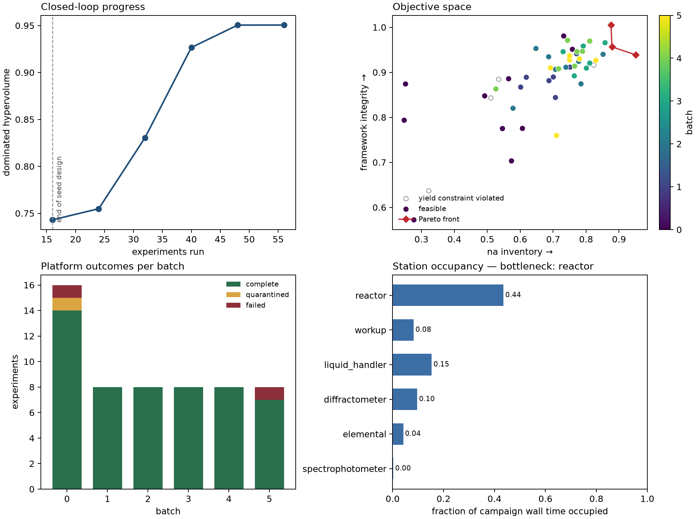
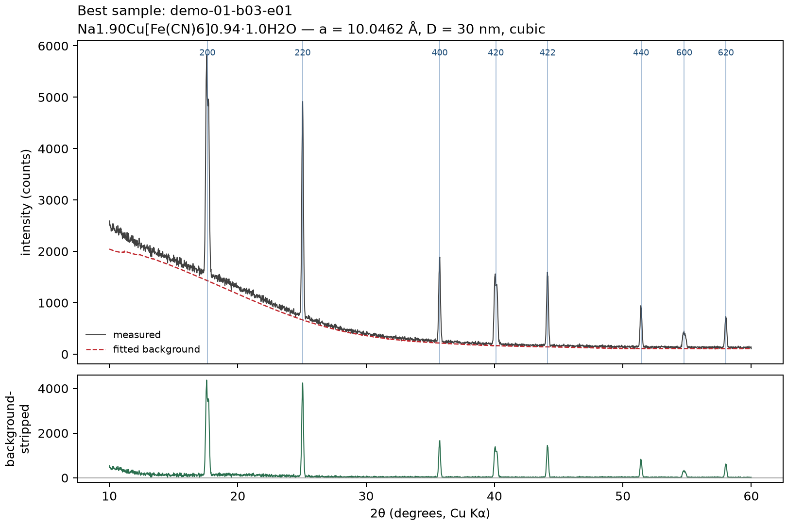
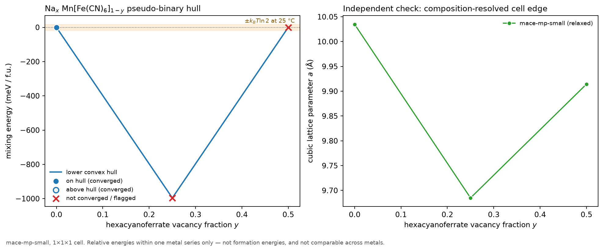
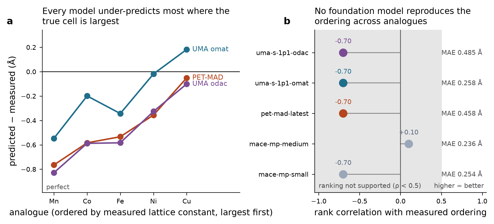
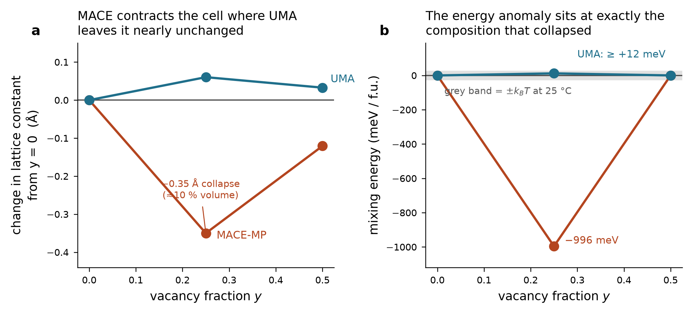
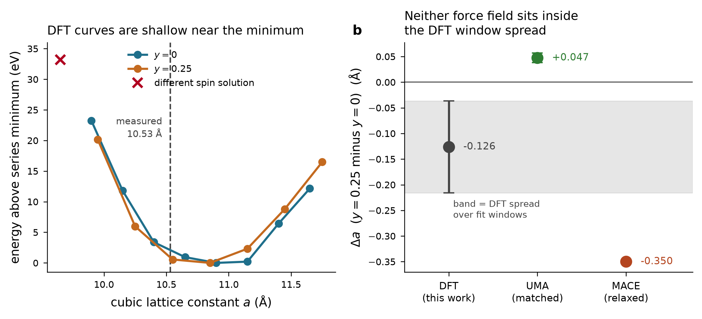

# Closed-loop orchestration and thermodynamic priors for Prussian blue analogue synthesis

**Project final report: technical summary**

This document describes all of the work in this project: what was built, what was measured,
what failed, and what remains open. It is the source material for the project's final report. Every number here was read from a saved result file;
the same numbers are in [key_results.json](key_results.json) in machine-readable form.

---

## 1. Summary

1. **An orchestrator for an autonomous PBA lab was built and tested** (`pba_autoworkflow`, 33 source
   files, 7,376 lines; 5 test files, 1,734 lines; 98 tests passing). It runs
   the full loop: plan → schedule on shared instruments → execute → analyse raw instrument
   traces → update a multi-objective surrogate → plan again. It also keeps a provenance store,
   recovers from crashes and resumes campaigns.
2. **It was demonstrated on a simulated deck only.** A 6-iteration, 56-experiment campaign raised the
   Pareto hypervolume from 0.743 to 0.951. **No laboratory data were used anywhere in
   this project.** All campaign numbers come from the simulator's hidden ground truth.
3. **Five foundation-model interatomic-potential configurations were benchmarked** (MACE-MP small and
   medium, PET-MAD, UMA with the `omat` head, UMA with the `odac` head) on the experimental
   lattice-constant trend across five PBA analogues. **None of them reproduces the cross-metal
   ordering**: four give Spearman ρ = −0.70 and one gives +0.10.
4. **A serial GPAW DFT build was made to work locally**, and 23 spin-polarised PBE
   single-point calculations were run on the Mn series. The resulting DFT mixing energy at
   y = 0.25 is **+271 meV/f.u.**, which is a demixing tendency. On a matched frozen-coordinate protocol UMA
   gives **+509** (correct sign, 1.9× too large). MACE-MP gives **-996** (wrong sign).
5. **Decision: UMA is the default backend.** What has been validated is narrow: the *sign*
   of the vacancy mixing energy within one metal. Magnitudes, cross-metal ranking and
   absolute lattice constants are **not** validated.
6. **A force-field hull cannot score proposed recipes**, because vacancy fraction is a
   measured outcome and not a synthesis parameter. The thermodynamics module therefore joins
   the campaign as a read-only *advisor*. It checks measurements after the fact and never
   steers the planner.

---

## 2. The orchestrator (`pba_autoworkflow`)

### 2.1 Architecture

| Layer | Module | Role |
|---|---|---|
| Closed loop | `campaign.py` | plan → register → execute → analyse → stop checks, once per iteration |
| Scheduling | `scheduler.py` | station pool with per-instrument capacity, batch concurrency |
| Workflow | `workflow.py` | turns a recipe into a sequence of device commands |
| Devices | `devices/` | one protocol per instrument class; simulated backend included |
| Analysis | `analysis/` | XRD, UV-vis and elemental traces → descriptors → objectives |
| Optimisation | `optimize/` | GP surrogate; qNEHVI, Sobol and random planners |
| Data model | `schema.py` | pydantic models, units in field names (`c_metal_M`, `temperature_C`) |
| Provenance | `provenance.py` | SQLite `campaign.db` plus raw traces as `.npz` |
| Simulator | `sim/` | hidden ground-truth chemistry and instrument physics |
| Thermodynamics | `thermo/` | force-field and DFT hulls, the advisory prior (Sections 4–6) |

**Isolation rule:** `analysis/` and `optimize/` may never import from `sim/`. They only see
what the platform would actually measure. The simulated backend rebuilds each recipe from the
device commands that were really issued, so a workflow bug appears as a wrong result instead
of being silently corrected.

### 2.2 Design points worth stating in the report

- **Recipe parameters** (planner-controlled): metal, `c_metal_M`, `c_hcf_M`, `c_nacl_M`,
  `c_citrate_M`, `ph`, `temperature_C`, `addition_rate_mL_min`, `aging_time_h`,
  `stir_rate_rpm`.
- **Objectives:** sodium inventory and framework integrity (two-objective Pareto front).
- **Replicates are scheduled, not assumed**, so platform noise is estimated from data.
- **Fault handling:** experiments are `complete`, `failed` or `quarantined`. A hardware fault
  ends one experiment, not the whole campaign.
- **Going live** means implementing one device protocol per instrument class. The campaign,
  analysis and optimisation layers stay as they are.

### 2.3 Simulated demonstration campaign



| Quantity | Value |
|---|---|
| Iterations / experiments | 6 / 56 (16 seed + 5 × 8) |
| Outcomes | 53 complete, 2 failed, 1 quarantined |
| Hypervolume by iteration | 0.743 → 0.755 → 0.831 → 0.927 → 0.951 → 0.951 |
| Pareto-front size | 3 |
| Bottleneck station | reactor |
| Best experiment | `demo-01-b03-e01`, Cu, Na1.90Cu[Fe(CN)6]0.94·1.0H2O |
| Best objectives | Na inventory 0.951, framework integrity 0.939 |

*Provenance note.* This reference campaign (`runs/demo-reference/`) was recorded before a fix that made the simulator's per-experiment noise independent of Python's per-process hash salt. The stored results are the record of that run, but re-running the same command now gives different (and, from now on, reproducible) numbers.



These results show the *machinery* working: the loop converges, it survives injected
faults and it allocates instruments sensibly. They say nothing about real PBA chemistry,
because the simulator's ground truth was written for this project.

---

## 3. The thermodynamics module (`pba_autoworkflow.thermo`)

**Purpose:** a computed stability prior, intended to warn the campaign away from compositions
that thermodynamics says should phase-separate.

**Composition model.** Na_x M[Fe(CN)₆]_(1−y)·nH₂O. Charge balance ties sodium to vacancy
fraction, x = 2 − 4y, so the charge-balanced path ends at y = 0.5 (Na = 0). Each vacancy is
filled by six water molecules. Cells are rock-salt with 4 formula units per cubic cell, and
vacancy decorations use SQS.

**Pipeline:** build structure → structure checks (bond lengths, coordination, O–H vs hydrogen
bond) → pre-relax the water → relax with a cubic-parameter scan → grand potential
Ω = E − μ_water·n_water → convex hull along the path → `HullPrior`.

**Built-in safeguards** (each was added after a real failure):
- *Path linearity check.* A pseudo-binary mixing energy is only defined if every species count
  is linear along the path. Clamping Na at zero above y = 0.5 broke this silently, so the
  hull now flags such paths as uninterpretable.
- *Implausibility threshold.* Features above `IMPLAUSIBLE_FEATURE_EV` = 0.20 eV/f.u. are
  reported as model failures, not as discoveries.
- *Resolvability.* A hull whose deepest feature is below kT is reported as `uninformative`.
  It contributes nothing to the campaign and does not act as a mid-range opinion.
- *Matched water reference.* μ_water must come from the same model as the framework. This is
  now enforced in code.



The MACE-MP hulls in the figure gave features of about −1 eV/f.u. for Mn and Ni, roughly
40× kT. The module flagged them as implausible. Section 5 confirms by DFT that this
was a model failure.

---

## 4. Benchmark of universal interatomic potentials

**Test:** relax the fully loaded framework for five analogues (Mn, Fe, Co, Ni, Cu) and compare
the cubic lattice constant with experiment. Ranking compositions requires getting this
ordering right.

| Model | MAE (Å) | Spearman ρ vs experiment |
|---|---|---|
| mace-mp-small | 0.254 | -0.70 |
| mace-mp-medium | 0.236 | +0.10 |
| pet-mad-latest | 0.458 | -0.70 |
| uma-s-1p1-omat | 0.258 | -0.70 |
| uma-s-1p1-odac | 0.485 | -0.70 |



**Findings**
- Every configuration fails the cross-metal ordering. PET-MAD and both UMA heads (checked
  individually) place Cu, the smallest measured cell, *above* Mn, the largest, which inverts
  the dominant trend.
- The identical ρ = −0.70 is an artefact of a discrete statistic at n = 5. The predicted
  orderings differ between models. What they share is the *structure* of the error: model error
  is strongly anti-correlated with the measured lattice constant.
- The `odac` UMA head was trained on MOFs with adsorbed water and is the closest published
  analogue to a hydrated framework. It did *not* help (MAE 0.485 Å), which argues against the
  idea that the failure comes simply from a lack of hydrated frameworks in the training data.
- **Cross-metal stability ranking is not supported by any model tested.**

**Practical notes:** UMA weights are licence-gated on HuggingFace and need an approved account
plus a token. `mace-torch` pins `e3nn==0.4.4`, while PET-MAD and fairchem need a newer
`e3nn`, so MACE and UMA/PET-MAD cannot be installed in one environment.

---

## 5. DFT calculations (GPAW)

### 5.1 Making GPAW run

The conda-forge GPAW links OpenMPI. OpenMPI cannot start in the sandbox: hwloc cannot read
the sysfs CPU topology, PMIx needs it, and OpenMPI needs PMIx. No environment-variable
workaround fixed this. conda-forge `nompi` builds exist only for GPAW 22.8.0 / Python ≤ 3.11.
**Fix:** a source build of GPAW 26.7.0 with no `siteconfig` (MPI is opt-in) and the conda C++
compiler. The resulting extension has no MPI/PMIx linkage. PAW datasets: `gpaw-setups-24.11.0`.
A spin-polarised Mn atom gives 5.000 μB (high-spin d⁵), as expected. GPAW 26.7 also has a
CuPy GPU backend (CUDA and ROCm), so the same inputs can be sent to a GPU node later.

**Measured cost:** 14.1 s per SCF iteration and 0.68 GB for the 64-atom cell
(gamma-point, spin-polarised, 20 OpenMP threads). Single points are affordable on a workstation.
Full ionic relaxations at many volumes are not.

### 5.2 Settings for all production calculations

GPAW 26.7.0 serial (source build); PBE; plane waves at 340 eV; gamma-point only; spin-polarised;
**frozen fractional coordinates** (cell scaled, ions not relaxed). Water reference:
μ_water = -9.9031 eV (isolated PBE H₂O at the same cutoff).

### 5.3 Mixing energy: the decisive result

A **formation** energy (relative to elemental standard states) was *not* computed; no
elemental references were calculated. The quantity the hull uses is the **mixing energy**:
the y = 0.25 grand potential relative to the straight line between the y = 0 and y = 0.5
endpoints. Elemental references cancel in that difference. Water content is linear in y
(0, 1.5 and 3.0 H₂O per f.u.), so the water term cancels by construction.

| Composition | DFT a_min (Å) | DFT E (eV/f.u.) | Converged points |
|---|---|---|---|
| y = 0 | 10.849 | -102.3947 | 8 |
| y = 0.25 | 10.792 | -92.7595 | 7 |
| y = 0.5 | 10.805 | -83.6667 | 7 |

| E_mix at y = 0.25 | meV/f.u. | Protocol |
|---|---|---|
| **DFT (PBE)** | **+271.2** | frozen coordinates |
| **UMA `omat`** | **+509.2** | frozen coordinates, same grid (matched) |
| UMA `omat` | +12.0 | relaxed coordinates |
| MACE-MP small | -995.9 | relaxed coordinates |


**Interpretation**
- DFT gives a positive mixing energy, 10.6 kT: the intermediate vacancy fraction is unstable
  with respect to the endpoints and tends to demix.
- **MACE-MP has the sign wrong.** It predicts strong ordering stability at y ≈ 0.25. A prior
  built on it would have pushed the campaign toward exactly the composition that DFT says
  phase-separates.
- **UMA has the sign right** and the magnitude within a factor of 1.9 on the matched protocol.
- The sign result is robust to the main approximation. Ionic relaxation would mostly
  stabilise the vacancy-bearing cells and lower the +271 meV by an unknown amount. It cannot
  turn −996 meV into a positive number.



MACE's energy anomaly sits at the same composition as an anomalous 0.35 Å lattice
contraction, while UMA's lattice barely changes. The structural failure and the energetic
failure are the same failure.

### 5.4 The lattice-change test was inconclusive



Δa(y = 0.25 − y = 0): DFT -0.126 ± 0.090 Å (spread across fit windows), UMA
+0.047 Å, MACE -0.350 Å. Neither force field lies inside the DFT spread, and the
DFT uncertainty is about 71 % of the DFT value, so this test **does not discriminate**. The
reasons are shallow E(a) curves, spin-moment drift across the grid (one point collapsed to
9.1 μB and was excluded), frozen ions, and PBE overestimating the Mn lattice constant
(DFT ≈ 10.85 Å vs 10.53 Å measured; that error is as large as the effect being tested).

---

## 6. Integration with the campaign

- **A hull cannot score a proposal.** `HullPrior` is indexed by (metal, vacancy fraction).
  Vacancy fraction comes from measured Fe/M ratios and CHN analysis
  (`CompositionDescriptors`); it is not in `SynthesisParameters`. Scoring a recipe would need
  a recipe → composition model, and that model is the surrogate itself.
- **What was built instead:** `ThermoAdvisor` (`thermo/advisor.py`). After each iteration it
  compares the hull with what the platform actually made (within-metal stability, plus a
  lattice-change discriminator that activates after 4 composition-resolved samples per
  metal). The result goes into `IterationRecord.thermo_advice`. It never changes what is
  proposed, and if it fails it records the error instead of stopping the campaign.
- **Defaults:** `DEFAULT_MODEL = "uma"` everywhere, through a single registry
  (`mlff.build_model`). `HullPrior` weight 0.15 (advisory). An uninformative hull costs
  exactly zero.

---

## 7. Defects found and corrected

Found during development; each one has a regression test.

| Defect | Consequence if left in | Fix |
|---|---|---|
| `HullPrior.penalty` charged uncomputed or uninformative metals 0.075 while computed-stable metals paid 0 | Missing evidence silently demoted a metal | `is_informative`; uninformative → 0 |
| `Planner.suggest(0)` crashed | Campaign crash whenever replicates fill a batch | All planners return `[]` |
| `water_reference_eV(None)` silently used MACE water | UMA hulls referenced against MACE water | Model is now required |
| Unknown model name fell back to MACE | A typo ran the wrong-sign backend | Raises `ValueError` |
| `run_hull.py` labelled every run `mace-mp-*` | Provenance of stored energies would be wrong | Records the backend that actually ran |
| Structure check counted hydrogen bonds as bad O–H contacts | False defect flags on hydrated cells | Covalent and H-bond distances separated |
| Na clamping broke path linearity | Mixing energies on an ill-defined path | Linearity check |
| `validate` printed "fixed-metal series are saved by error cancellation" | Unfounded reassurance | Retracted; MACE and UMA disagree by 1.0 eV |
| Lattice fits accepted unbracketed minima | Spurious lattice constants | Fit refuses edge minima |

### Claims made during the project that were later corrected

For an honest report these should be stated, not hidden:
- "No suitable existing model exists" — withdrawn once UMA access made a direct test possible.
- "Local DFT is impractical" — wrong. The measured cost showed single points are affordable.
- "The two-structure lattice scan will be decisive" — it was not (Section 5.4). The
  *mixing energy* turned out to be the discriminating quantity.
- The magnitude argument against MACE (about 1 eV ≫ kT) was originally a plausibility
  inference. Section 5.3 now backs it with a direct measurement.

---

## 8. Limitations

1. No laboratory data. The orchestrator has only been run on the simulator.
2. DFT is PBE, gamma-point only, frozen ions, no dispersion correction, no Hubbard U, a single
   metal (Mn), one SQS decoration per composition, and the spin state is not fixed across the
   lattice grid.
3. Only one interior point (y = 0.25) on the mixing path, so the hull shape is not resolved.
4. UMA validation covers the *sign* of one quantity for one metal.
5. No potential was fine-tuned. All models were used as released.

## 9. Recommended next steps

1. **Connect real instruments** through the device protocols and run a short seed campaign.
   Put 4 or more composition-resolved samples on one metal in the seed design so the advisor's
   lattice discriminator activates.
2. **DFT on a cluster:** fixed total magnetic moment, ionic relaxation at each volume, D3
   dispersion, Hubbard U on the 3d metals, k-point sampling, more interior y points, then the
   other metals.
3. **Fine-tune UMA** on those 20–50 DFT structures and re-run the lattice-trend benchmark.
   Cross-metal ranking is the gap that matters for a campaign that varies the metal.
4. Watch for a code release of TIP[UMA] (arXiv:2608.14502, Gibbs free-energy extension of UMA).
   It targets exactly the miscibility question studied here.

---

## 10. Reproduction and environments

| Environment | Contents | Use |
|---|---|---|
| `pba-mlff` | mace-torch, fairchem-core (UMA), pet-mad, socksio | force fields, orchestrator tests |
| `pba-gpaw` | libxc, openblas, fftw, C/C++ compilers, ase, pydantic + GPAW wheel | DFT |

```bash
# Orchestrator
pip install -e .[test,thermo]
python -m pba_autoworkflow run --runs runs/demo --iterations 6 --n-seed 16 --batch-size 8
pytest tests -k "not one_degree and not stays_cubic and not overlap"   # 98 pass

# Thermodynamics (UMA needs HF_TOKEN with approved facebook/UMA access)
python -m pba_autoworkflow.thermo validate --model uma --uma-task omat
python -m pba_autoworkflow.thermo hull --metal Mn --vacancies 0.0,0.25,0.5

# DFT
# GPAW 26.7.0 serial build: see docs/DFT.md; then fetch the PAW datasets:
gpaw install-data --gpaw --no-register setups/ && export GPAW_SETUP_PATH=$PWD/setups/gpaw-setups-24.11.0
python scripts/dft_lattice_scan.py          # checkpoints per point, resumable
python scripts/plot_mixing_energies.py
```

## 11. File index

| File | Contents |
|---|---|
| [key_results.json](key_results.json) | Every quoted number, machine-readable |
| [`pba_autoworkflow/`](../pba_autoworkflow), [`tests/`](../tests) | Orchestrator, thermodynamics module and tests |
| [`scripts/`](../scripts), [`runs/`](../runs) | Drivers, and every force-field and DFT result JSON |
| [README.md](../README.md) | Orchestrator documentation |
| [THERMO.md](THERMO.md) | Thermodynamics module: validation, safeguards, integration |
| [DFT.md](DFT.md) | GPAW build recipe, DFT results and caveats |
| [WALKTHROUGH.txt](WALKTHROUGH.txt) | Stage-by-stage executed walkthrough of the thermo pipeline |
| [experiments.csv](../runs/demo-reference/experiments.csv) | All 56 simulated experiments with descriptors |
| [iterations.csv](../runs/demo-reference/iterations.csv) | Per-iteration campaign record |
| [summary.json](../runs/demo-reference/summary.json) | Simulated campaign summary |
| [energies_Mn.json](../runs/mace_hull/energies_Mn.json) | Stored MACE energies, Mn series |
| [energies_Ni.json](../runs/mace_hull/energies_Ni.json) | Stored MACE energies, Ni series |
| gpaw-26.7.0-cp312-cp312-linux_x86_64.whl — *not in the repository; see [README](../README.md#large-files-not-included)* | Serial GPAW build |
| gpaw_setups_24.11.0.tar.gz — *not in the repository; see [README](../README.md#large-files-not-included)* | PAW datasets |
| mace_mp_small_weights.tar.gz — *not in the repository; see [README](../README.md#large-files-not-included)* | Cached MACE-MP weights |

## 12. Notes for contributors

- Large inputs are not versioned: download the PAW datasets and model weights as described in
  the README. Do not commit them.
- UMA weights are licence-gated: request access to `facebook/UMA` on HuggingFace and export
  `HF_TOKEN`. Never commit a token. Setting `HF_HUB_DISABLE_XET=1` helps behind restrictive proxies.
- Keep MACE and UMA/PET-MAD in separate environments (`e3nn` version conflict).
- `ProvenanceStore` takes a *directory*, not a SQLite path. Tests must use `tmp_path`.
- Long DFT scans checkpoint after every point (`runs/dft/lattice_scan.json`) and can be resumed.
- Quote numbers from `docs/key_results.json`; do not retype values.
