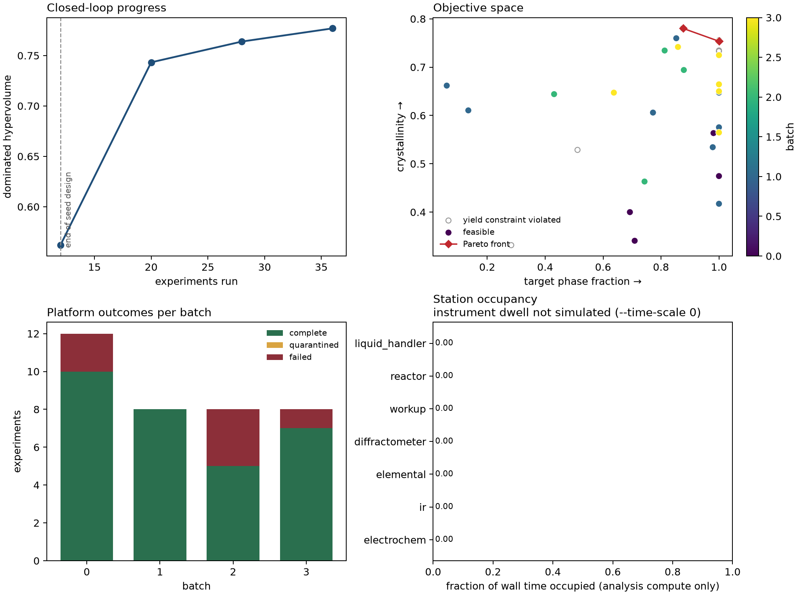
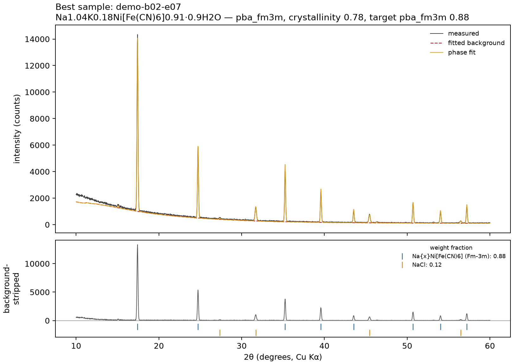
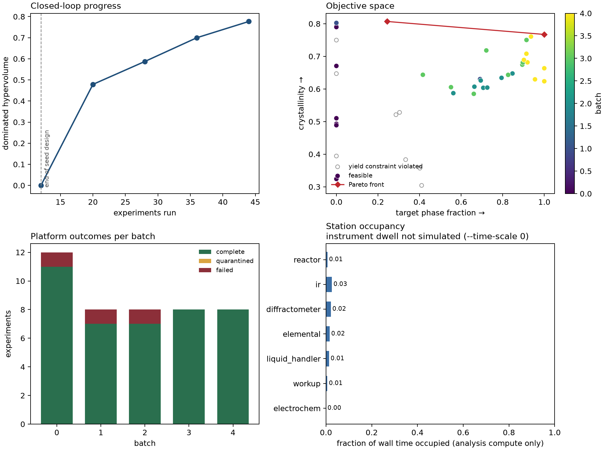
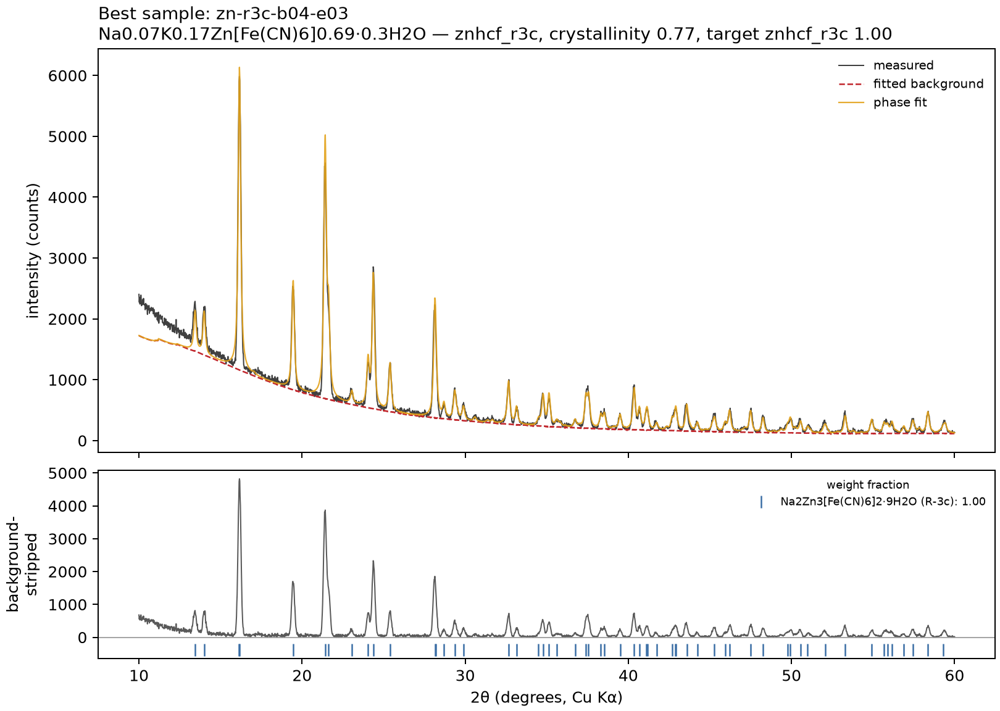

# 2. Quick start

This chapter runs a complete campaign on the **simulated deck**: simulated instruments that
reproduce PBA co-precipitation chemistry, measurement noise and instrument faults. No hardware is
needed. All output below is real output from these commands (long lines shortened with `…`).

## Step 1: check a batch without running it

```bash
pba-autoworkflow dry-run --batch-size 6
```

```
       metal     c_metal_M       c_hcf_M      c_nacl_M   c_citrate_M            ph  temperature_C  …
          Ni        0.1805        0.2375          1.27         0.164          1.84         61.45  …
          Co       0.01336       0.02697         2.959        0.3285         5.292         28.46  …
          Zn       0.05202       0.08193       0.06559       0.01646          6.97         56.67  …
          Cu        0.1042       0.02177         1.756          0.42         3.495         89.64  …
          Mn       0.06143       0.09485         3.148        0.3865         2.759         70.33  …
          Fe       0.02495       0.01198         1.353        0.1061         6.244         37.36  …

6 recipes, 0 feasibility problems
```

(The table is cut at the right; it continues with the remaining recipe columns.)

`dry-run` plans the seed batch and runs the platform's recipe checks, but touches no device.
Use it whenever you change the design space, before committing reagents.

## Step 2: run a campaign

```bash
pba-autoworkflow run --runs runs/demo --campaign-id demo --iterations 3 --batch-size 8 --time-scale 0
```

```
iteration 0: running 12 experiments (sobol)
  demo-b00-e01 failed — hardware: rx-01: over-temperature interlock tripped during ramp
  demo-b00-e11 failed — hardware: wu-01: pellet lost during decant
iteration 0: HV=0.5619 (Δ+0.5619) best=0.3204 counts={'complete': 10, 'failed': 2} …
iteration 1: running 8 experiments (qnehvi, replicate)
iteration 1: HV=0.7433 (Δ+0.1814) best=0.4202 counts={'complete': 8} …
iteration 2: running 8 experiments (qnehvi, replicate)
  demo-b02-e01 failed — hardware: wu-01: pellet lost during decant
  demo-b02-e04 failed — hardware: wu-01: pellet lost during decant
  demo-b02-e05 failed — hardware: lh-01: tip clogged during aspiration
iteration 2: HV=0.7639 (Δ+0.0206) best=0.4315 counts={'complete': 5, 'failed': 3} …
…
best recipe:
  metal                  Ni
  …
  hcf_precursor          K3FeCN6
  …
  dry_temperature_C      73.7013845006004
  dry_pressure_mbar      241.44859986613525
  dry_gas                ambient
  …
  -> Na1.04K0.18Ni[Fe(CN)6]0.91·0.9H2O  capacity 73.8 mAh/g  yield 0.45
platform reproducibility (relative SD over replicate groups):
  rsd_target_phase_fraction 0.0105
  rsd_crystallinity        0.0282
  n_replicate_groups       2.0000
  n_replicate_runs         4.0000
```

(Lines for experiments that completed normally are omitted.) The same command with the same
`--seed` gives identical results on any machine.

What happened:

- **Iteration 0** is the seed design: 12 points from a scrambled Sobol' sequence (`--n-seed`,
  default 12). The planner has no data yet, so it covers the space evenly.
- **Iterations 1 and 2** are chosen by the Bayesian planner (qNEHVI) from a Gaussian-process
  model of all results so far. A fraction of each batch (`--replicate-fraction`, default 0.15)
  repeats earlier recipes, to measure run-to-run scatter.
- **HV** is the dominated hypervolume of the feasible results, the campaign's measure of progress.
  It can only rise or stay level as data accumulate.
- Runs end in one of three states. **complete**: usable result. **failed**: an instrument fault,
  never counted against the recipe. **quarantined**: the data were produced but failed a physical
  sanity check, so they are kept out of the model. Chapter 3 lists the checks. A recipe that
  fails the platform's recipe check (for example, more citrate than the stock solution can
  supply) is refused before any reagent is dispensed.
- The best recipe uses K₃[Fe(CN)₆], and both Na (from the NaCl) and K are on the A sites.
  Precursor, drying temperature, pressure and gas are all chosen by the planner.
- With no `--target-phase`, the campaign optimises for the cubic framework (`pba_fm3m`). Step 6
  runs a campaign for a different polymorph, and step 7 one with electrochemical objectives.

`--time-scale 0` skips all simulated instrument waiting. Use `2e-4` to see realistic contention
between stations within seconds, or `1.0` for a full-length timing rehearsal.

The default simulator injects faults on purpose, so the error-handling paths are exercised on
every run: 4 % of runs lose their product (`--failure-rate`), and each instrument operation has a
1 % chance of a terminal hardware fault (`--mechanical-fault-rate`) and a 2 % chance of a
communication error (`--transport-fault-rate`). Communication errors are retried automatically.
Set `--failure-rate 0 --mechanical-fault-rate 0 --transport-fault-rate 0` for a fault-free run.

## Step 3: resume

A campaign is resumed from its store; nothing is held in memory between commands. This works after
a crash, after a power cut, or when you want to add budget.

```bash
pba-autoworkflow resume --runs runs/demo --iterations 1 --time-scale 0
```

```
resumed demo with 28 experiments
iteration 3: running 8 experiments (qnehvi, replicate)
  demo-b03-e01 failed — hardware: rx-01: over-temperature interlock tripped during ramp
iteration 3: HV=0.7770 (Δ+0.0131) best=0.4315 counts={'complete': 7, 'failed': 1} …
```

The resumed batch continues the numbering (iteration 3) and the model is rebuilt from the stored
results. The hypervolume rose slightly (0.7639 → 0.7770); the best single recipe did not change.

## Step 4: inspect

```bash
pba-autoworkflow status --runs runs/demo
```

```
campaign      demo
experiments   36
status        {'complete': 30, 'failed': 6}
next batch    4

device        calls   busy_s   failed
  ir-01           30      1.7       0
  icp-01          30      1.5       0
  xrd-01          30      1.0       0
  wu-01          123      0.9       3
  rx-01          136      0.3       2
  lh-01          142      0.3       3
```

## Step 5: report

```bash
pba-autoworkflow report --runs runs/demo
```

```
experiments    runs/demo/report/experiments.csv
iterations     runs/demo/report/iterations.csv
summary        runs/demo/report/summary.json
overview       runs/demo/report/campaign_overview.png
best_pattern   runs/demo/report/best_pattern.png
```

| File | Contents |
|---|---|
| `experiments.csv` | One row per experiment: recipe, status, descriptors (phase weight fractions and lattices, crystallinity, lattice constant, domain size, composition with Na and K, IR Fe(II) share, charge-balance residual, drying-rate index), objectives |
| `iterations.csv` | One row per batch: counts, hypervolume, best score, wall time, bottleneck station |
| `summary.json` | Campaign summary, Pareto front, best recipe, stop reason |
| `campaign_overview.png` | The four-panel figure below |
| `best_pattern.png` | The XRD pattern of the best sample with the whole-pattern phase fit |



*Top left: hypervolume against experiments run, rising from 0.562 to 0.777. Top right:
target-phase fraction against crystallinity for every run, coloured by batch; open circles failed
the yield constraint, and the red diamond marks the Pareto front. Of the 15 runs below 0.9, five are Zn
recipes that formed partly or wholly R-3c (two also with NaCl or ZnO), eight contain 0.12–0.31
NaCl, one Cu run contains 0.35 CuO, and one Co run is discounted for 0.29 unidentified intensity.
Bottom left: run outcomes per batch. Bottom right: station occupancy. With `--time-scale 0` no
instrument time is simulated, so this panel is empty here; run with `--time-scale 2e-4` or larger
to see which station limits throughput.*



*The best sample, demo-b02-e07, Na<sub>1.04</sub>K<sub>0.18</sub>Ni[Fe(CN)<sub>6</sub>]<sub>0.91</sub>·0.9H<sub>2</sub>O
(*a* = 10.1760 Å; 0.88 cubic and 0.12 NaCl by weight): measured pattern, fitted background and the
whole-pattern phase fit (top); background-stripped pattern with the reflection ticks and weight
fraction of every identified phase (bottom). Peaks no library phase explains are marked with red
triangles.*

## Step 6: a polymorph campaign

Zinc hexacyanoferrate forms either the cubic framework or the rhombohedral R-3c phase
Na<sub>2</sub>Zn<sub>3</sub>[Fe(CN)<sub>6</sub>]<sub>2</sub>, depending on precipitation and drying. To
optimise for R-3c, name it as the target:

```bash
pba-autoworkflow run --runs runs/zn --campaign-id zn-r3c --target-phase znhcf_r3c --iterations 5 --batch-size 8 --time-scale 0
```

```
iteration 0: HV=0.0000 (Δ+0.0000) best=0.0197 counts={'complete': 11, 'failed': 1} …
iteration 1: HV=0.4788 (Δ+0.4788) best=0.3482 counts={'complete': 7, 'failed': 1} …
iteration 2: HV=0.5874 (Δ+0.1086) best=0.3611 counts={'complete': 7, 'failed': 1} …
iteration 3: HV=0.6999 (Δ+0.1125) best=0.4167 counts={'complete': 8} …
iteration 4: HV=0.7769 (Δ+0.0770) best=0.4278 counts={'complete': 8} …
…
best recipe:
  metal                  Zn
  hcf_precursor          K3FeCN6
  …
  dry_temperature_C      66.29240864215302
  dry_pressure_mbar      620.5018572469733
  dry_gas                ambient
  -> Na0.07K0.17Zn[Fe(CN)6]0.69·0.3H2O  capacity 13.0 mAh/g  yield 0.78
```

The search space still contains all six metals. The seed batch tried each of them twice. Only
zinc can form R-3c, so the first seed batch scores zero hypervolume, and the planner then moved
to zinc: 6 of 8 recipes in batch 1 and all 8 from batch 2 on. The best recipe dries slowly
(drying-rate index Π = 0.41, chapter 3), as the zinc hexacyanoferrate study found for R-3c. The
low capacity is expected: Zn is not redox-active, and the capacity estimate counts only the A
cations present in the as-made solid.





*The best sample, zn-r3c-b04-e03: single-phase R-3c by weight, crystallinity 0.77. Chapter 3
describes how these fractions are computed and where they are unreliable, for example in poorly
ordered samples.*

A campaign's target phase is stored with it. `resume` keeps it, and naming a different
`--target-phase` for an existing campaign is refused; start a new campaign id instead.

## Step 7: electrochemical objectives

Any objective from the electrochemistry list in chapter 3 adds cycling and competitive-insertion
measurements to every run. This campaign asks for cubic frameworks that take up Zn²⁺ despite K⁺
and keep their Zn²⁺ capacity:

```bash
pba-autoworkflow run --runs runs/ec --campaign-id zn-tol --objectives target_phase_fraction,zn_tolerance,zn_retention --iterations 4 --batch-size 8 --time-scale 0
```

```
iteration 0: running 12 experiments (sobol)
  zn-tol-b00-e01 failed — hardware: rx-01: over-temperature interlock tripped during ramp
  zn-tol-b00-e11 failed — device: ec-01: simulated bus timeout
iteration 0: HV=0.0000 (Δ+0.0000) best=0.0321 counts={'complete': 10, 'failed': 2} …
iteration 1: running 8 experiments (qnehvi, replicate)
  zn-tol-b01-e00 failed — hardware: ec-01: cell short circuit
iteration 1: HV=0.0369 (Δ+0.0369) best=0.0529 counts={'failed': 1, 'complete': 7} …
iteration 2: HV=0.0475 (Δ+0.0106) best=0.0596 counts={'complete': 8} …
iteration 3: HV=0.0475 (Δ+0.0000) best=0.0596 counts={'complete': 8} …
```

Read this as a demonstration that the stage runs, not as a converged result. In the simulator
every non-zinc framework prefers K⁺ by α<sub>K/Zn</sub> ≈ 2.4–2.6 × 10⁴, beyond the 10⁴ end of the scale, and
scores `zn_tolerance` = 0. Zinc
frameworks span α<sub>K/Zn</sub> ≈ 1.3 × 10³–7.5 × 10³, i.e. `zn_tolerance` 0.02–0.11. The
three-objective hypervolume is therefore small, and four batches did not settle on zinc (6 of 8
recipes in batch 1, then 1 per batch). The Pareto front has five recipes, three of them zinc.
The best-ranked run, zn-tol-b02-e07, is a 1 : 1 cubic/R-3c zinc framework with α<sub>K/Zn</sub> = 1500
(predicted from its formal potentials: 2243) and 91 % Zn²⁺ retention after 20 cycles. Its plateau
fraction is 0.12, between two-phase and solid solution, as expected for a phase mixture.

## Command reference

| Command | Purpose |
|---|---|
| `run` | Start a campaign, or continue one whose `--campaign-id` already exists in `--runs` |
| `resume` | Continue the campaign found in `--runs` |
| `status` | Experiment counts and per-device statistics |
| `report` | Write CSV, JSON and figures to `<runs>/report/` |
| `dry-run` | Plan and check one batch without touching a device |

Main options of `run` and `resume` (see `pba-autoworkflow run --help` for the full list):

| Option | Default | Meaning |
|---|---|---|
| `--runs` | `runs/demo` | Store directory (database and raw traces) |
| `--iterations` | 6 | Number of batches to run in this call |
| `--n-seed` | 12 | Size of the Sobol' seed batch |
| `--batch-size` | 8 | Experiments per Bayesian batch |
| `--planner` | `bayes` | `bayes` (qNEHVI), `sobol` or `random` |
| `--replicate-fraction` | 0.15 | Share of each batch spent on replicates |
| `--max-in-flight` | 4 | Experiments executing concurrently |
| `--reactor-capacity` | 4 | Reactor positions |
| `--seed` | 0 | Random seed for planner and simulator |
| `--target-phase` | campaign's recorded target, else `pba_fm3m` | `pba_fm3m`, `pba_p21n` or `znhcf_r3c` |
| `--objectives` | campaign's recorded objectives, else `target_phase_fraction,crystallinity` | Comma-separated; see chapter 3 |
| `--time-scale` | 0.0 | Fraction of simulated instrument time actually waited |
| `--no-report` | off | Skip writing the report at the end |
